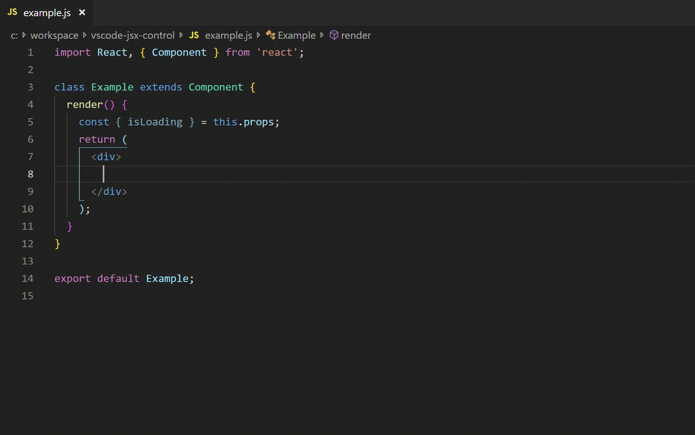

# jsx-control-snippets

Code snippets for [JSX Control Statements](https://www.npmjs.com/package/jsx-control-statements)

## Installation

In order to install an extension you need to launch the Command Pallete (Ctrl + Shift + P or Cmd + Shift + P) and type Extensions. There you have either the option to show the already installed snippets or install new ones.

## Supported languages (file extensions)
- JavaScript (.js)
- TypeScript (.ts)
- JavaScript React (.jsx)
- TypeScript React (.tsx)

## Usage

## snippets
| Trigger    | Content                   |
|-----------:|---------------------------|
| `ifc→`     | Create an If component    |
| `choosec→` | Create a Choose Component |
| `forc→`    | Create a For Component    |
| `withc→`   | Create a With Component   |
